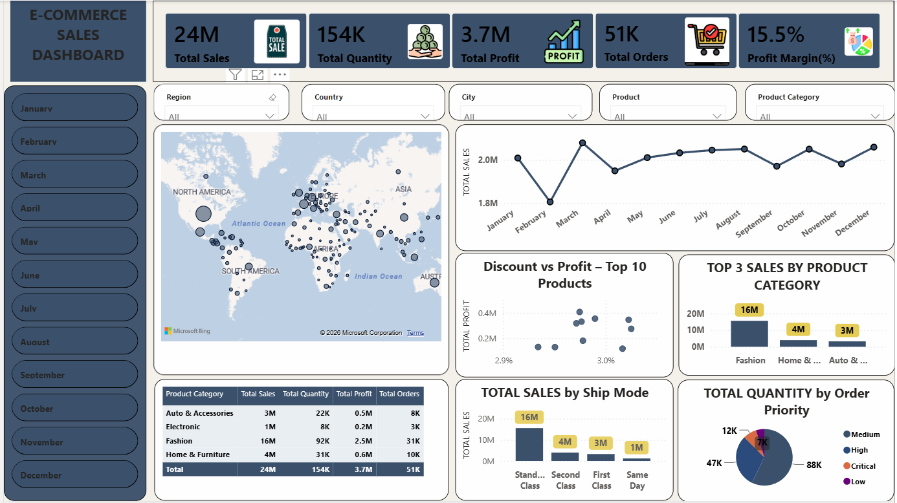
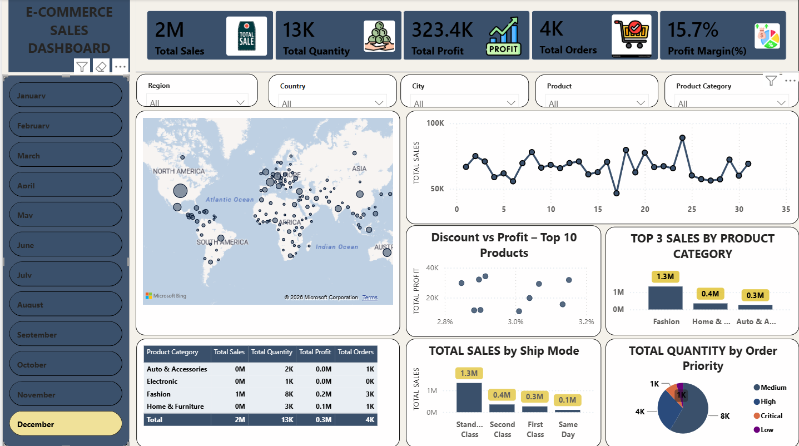
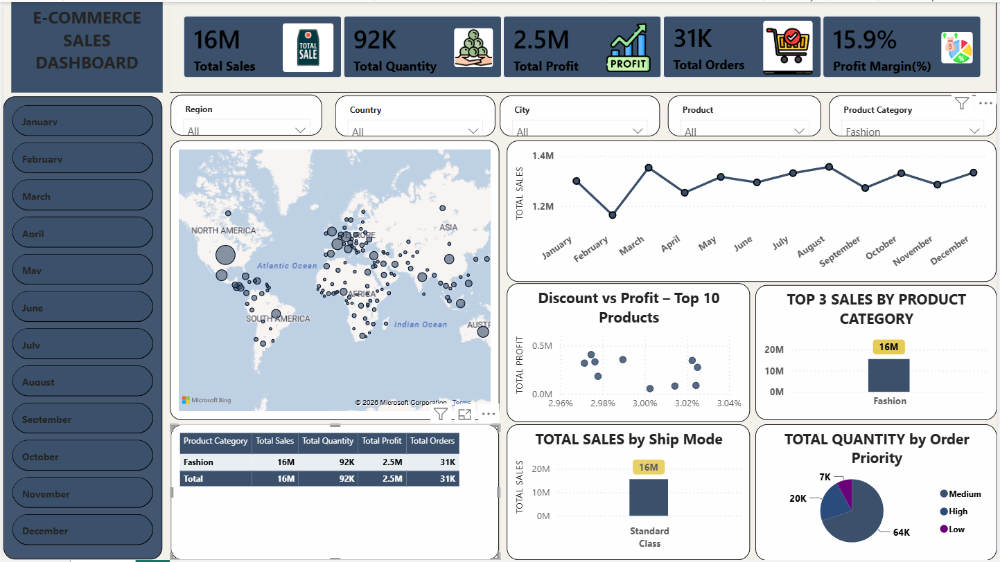
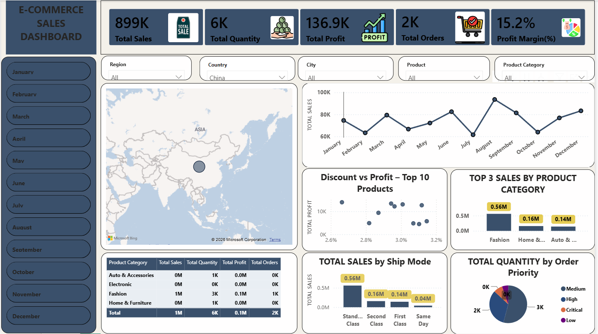

# E-Commerce Sales & Profit Analysis Dashboard

## Overview

This project is an **interactive Power BI dashboard** built to analyze e-commerce sales, profit, orders, product performance, shipping methods, and regional sales. The dashboard helps explore overall business performance through KPIs, trends, comparisons, and interactive filters.

## Dashboard Screenshots

### Main Overview



### Monthly Trends



### Category Analysis



### Regional Analysis


### Country Analysis



## Key Insights & Analytics Features

* **KPIs:** Total Sales, Total Quantity, Total Profit, Total Orders, Profit Margin %
* **Interactive Slicers:** Region, Country, City, Product, Product Category, and Month
* Monthly sales trend analysis
* Top product category analysis
* Sales by shipping mode
* Order priority analysis
* Regional and country-level sales analysis
* **Discount vs Profit** analysis for the Top 10 Products
* Category-level comparison using an interactive table

## Tools & Tech Stack

* **Power BI Desktop**
* **Power Query** for data preparation and validation
* **DAX** for calculated measures
* **Data Modeling**
* **Microsoft Excel** for the source dataset

## Key DAX Measures

```DAX
AVERAGE DISCOUNT =
AVERAGE('E-COMMERCE DATA'[Discount])

AVERAGE SALES =
AVERAGE('E-COMMERCE DATA'[Sales])

TOTAL SALES =
SUMX(
    'E-COMMERCE DATA',
    'E-COMMERCE DATA'[Sales] * 'E-COMMERCE DATA'[Quantity]
)

TOTAL QUANTITY =
SUM('E-COMMERCE DATA'[Quantity])

TOTAL PROFIT =
SUM('E-COMMERCE DATA'[Profit])

TOTAL ORDERS =
COUNTROWS('E-COMMERCE DATA')

PROFIT MARGIN % =
DIVIDE(
    [TOTAL PROFIT],
    [TOTAL SALES],
    0
)
```

## Repository Structure

* `E-COMMERCE SALES DASHBOARD.pbix` - Power BI report
* `E_Commerce_Dashboard_Project.xlsx` - Dataset used for the dashboard
* `overview_dashboard.png` - Main dashboard view
* `monthly_filtered_view.png` - Monthly analysis view
* `category_filtered_view.png` - Category analysis view
* `regional_analysis_view.png` - Regional analysis view
* `Country_analysis_view.png` - Country analysis view

## Interactive Power BI Report

[**View Interactive Dashboard**](https://app.powerbi.com/links/m73plopFaQ?ctid=6097692a-0a7b-4e97-be15-92710bdb2994&pbi_source=linkShare)
