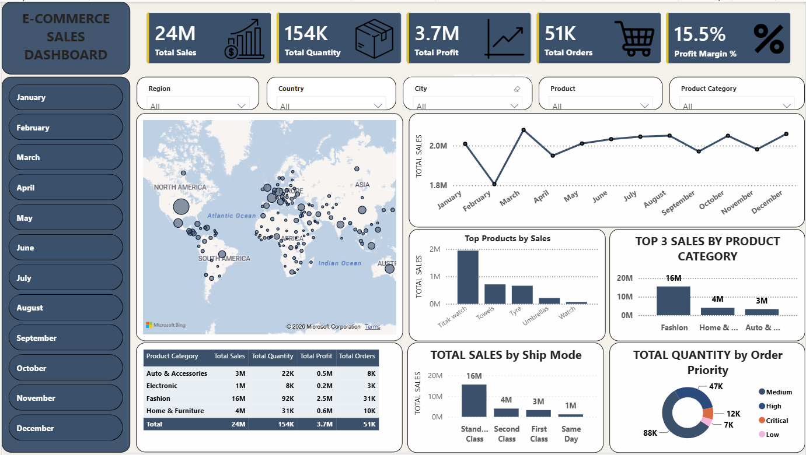
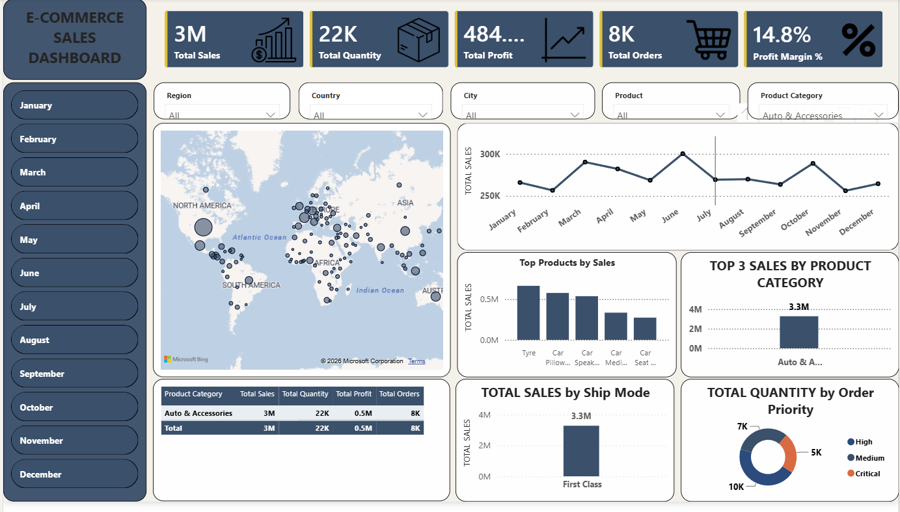
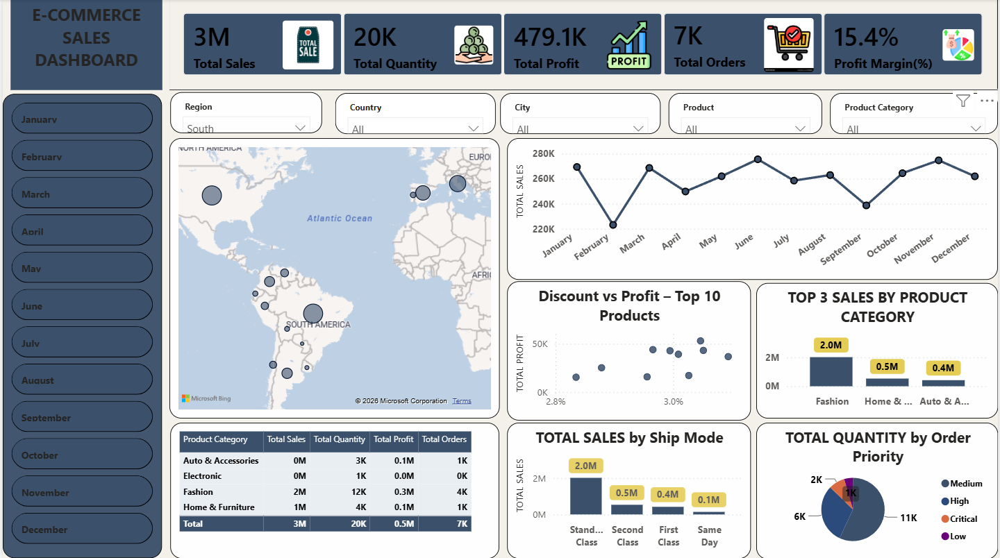

# E-Commerce Sales Dashboard

An interactive Power BI dashboard to analyze global e-commerce sales, total profit, order quantity, and overall profitability across regions, product categories, and shipping modes.

---

## Dashboard Screenshots

### Overview

### Category Filtered View

### Regional Analysis View

---

## Key Metrics & Analysis Covered
- **Executive KPIs:** Total Sales ($24M), Total Quantity (154K), Total Profit ($3.7M), Total Orders (51K), and Profit Margin % (15.5%).
- **Interactive Filters:** Multi-select Slicers for Region, Country, City, Product, Product Category, and Months.
- **Visuals Included:**
  - **Global Sales Map:** Geographic distribution of sales.
  - **Monthly Sales Trend:** Line chart tracking sales across months.
  - **Category Breakdown:** Top product categories by sales volume.
  - **Top Products:** Bar chart highlighting top-selling items.
  - **Shipping & Priority:** Sales breakdown by Ship Mode and Quantity distribution by Order Priority (Donut Chart).
  - **Summary Table:** Tabular view of Category-wise Sales, Quantity, Profit, and Orders.

---

## Repository Structure
- `E-COMMERCE SALES DASHBOARD.pbix` - Power BI Dashboard File
- `E_Commerce_Dashboard_Project.xlsx` - Raw Dataset
- `dashboard_overview.png` - Dashboard Screenshot
- `category_filter_view.png` - Filtered Category Screenshot
- `regional_analysis_view.png` - Regional View Screenshot
